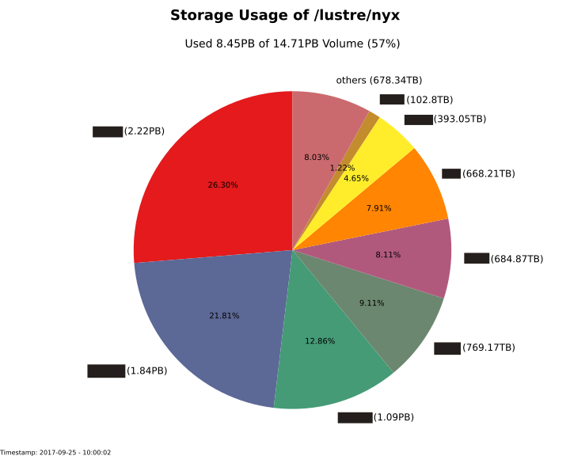

# lustre-scripts
Useful scripts based on the Lustre file system (http://lustre.org/) and the Robinhood Policy Engine (https://github.com/cea-hpc/robinhood).

## Lustre Job Analyser

__Description:__

Produce an overview of the Slurm jobs that have a higher write or read sample count based on the Lustre job statistics regarding specfied file server (OSS).

__Requisites:__

* Enabled Lustre job stats.
* _ClusterShell_ - For executing remote commands in parallel from a workstation on the cluster.
* _show_high_jobstats.pl_ - Perl script to collect and filter queried jobstats from Lustre OSS  
(https://www.scc.kit.edu/scc/sw/lustre_tools/show_high_jobstats.tgz).
* _slurm-client_ - Squeue command to query Slurm information about jobs.

__Script Parameter:__

* -D/--enable-debug: Enables debug log messages.
* -u/--user: User for executing remote commands e.g. querying Lustre job statitics or squeue information from Slurm.
* -s/--oss-nodes: Specification of OSS nodes by using ClusterShell NodeSet syntax.
* -n/--client-node: Specification of Client Node.
* -m/--min-samples: Minimum number of read or write Lustre jobstats sample count.
* -j/--path-jobstats-file: Specifies path to save Lustre jobstats file.
* -C/--create-jobstats-file: Specifies if a new Lustre jobstats file should be created.

__Script Execution:__

```
lustre_job_analyser.py -s file_server[000-100] -n client_node0200 -u admin_user -m 10000 -j lustre_jobstats_file.unl -C
```

__Output Schema:__

SLURM_JOB_ID|USER|GROUP|EXECUTABLE|CLIENT_NODE_LIST|FILE_SERVER_LIST  
...  
SLURM_JOB_ID|USER|GROUP|EXECUTABLE|CLIENT_NODE_LIST|FILE_SERVER_LIST  

## Lustre Collect Changelog Indexes

__Description:__

This script collects changelog indexes from a Lustre MDT.  
It can be executed continuously or just in a capture mode.  

for displaying the delta between the Lustre changelog index and the specified changelog reader index.

__Script Parameter:__

* -i/--interval: Specifies the collect interval in seconds.
* -d/--delimiter: Defines the delimiter for unloaded indexes.
* -m/--mdt-name: Specifies the MDT name where to read the current index from.
* -r/--changelog-reader: Specifies an additional changelog reader to read the index from.
* -f/--unload-file: Specifies the unload file where the collected information is saved (changelog_indexes.unl).
* --direct-flush: If enabled after each collection interval a disk write flush is done of the collected values.
* --capture-delta: Prints the delta between the changelog consumer and the MDT index after one interval on the stdout and quits.

__Script Execution:__

Continuous Collect Mode:
```
lustre_collect_changelog_indexes.py -m fs-MDT0000 -r cl1
```

Capture Delta Mode:
```
lustre_collect_changelog_indexes.py -m fs-MDT0000 -r cl1 --capture-delta
```

__Output Schema:__

In Continuous Collect Mode:  
* TIMESTAMP;
* MDT CHANGELOG INDEX PRODUCER COUNT;
* CHANGELOG READER INDEX CONSUMER COUNT;
* DELTA BETWEEN CHANGELOG READER INDEX AND MDT CHANGELOG INDEX

In Capture Delta Mode:  
DELTA BETWEEN CHANGELOG READER INDEX AND MDT CHANGELOG INDEX


## Lustre Storage Report

__Description:__

The Lustre Storage Report consists of two separate Python programms:

1. rbh-acct-stat-history.py
1. rbh-acct-report.py

### rbh-acct-stat-history.py

__Description:__

This program takes daily snapshots of aggregated storage consumption per user from the Robinhood accounting database table and saves the gathered information in a separate accounting history table for further analysis or processing.

__Requisites:__

python-mysqldb - Python interface to MySQL

__Script Parameter:__

* -f/--config-file: Path of the config file.
* -D/-enable-debug: Enables logging of debug messages.
* --create-table: If set the accounting history table is created.

__Structure of the Configuration File:__

```
[mysqld]
host          =·
user          =·
password      =·

[history]
database                =·
acct_stat_history_table = ACCT_STAT_HISTORY

[robinhood]
database        =·
acct_stat_table = ACCT_STAT

[mail]
server    =·
sender    =·
recipient =·
```

__Script Execution:__

Executing the rbh-acct-stat-history with debug messages saved into a proper log file:

```
./rbh-acct-stat-history.py -f rbh-acct-stat-history.conf -D >> rbh-acct-stat-history.log 2>&1
```

__Schema of the Accounting History Table:__

```
+-------+---------------------+------+-----+------------------+-------+
| Field | Type                | Null | Key | Default          | Extra |
+-------+---------------------+------+-----+------------------+-------+
| uid   | varbinary(127)      | NO   | PRI | 0x756E6B6E6F776E |       |
| gid   | varbinary(127)      | NO   | PRI | 0x756E6B6E6F776E |       |
| size  | bigint(20) unsigned | YES  |     | 0                |       |
| count | bigint(20) unsigned | YES  |     | 0                |       |
| date  | date                | NO   | PRI | NULL             |       |
+-------+---------------------+------+-----+------------------+-------+
5 rows in set (0.00 sec)

```

### rbh-acct-report.py

__Description:__

It creates pie charts with top n groups which can be sent per mail based on a date from the accounting history table or directly from the Robinhood accuting table.

__Requisites:__

* python-mysqldb - Python interface to MySQL
* python-matplotlib - Python based plotting system in a style similar to Matlab

__Script Parameter:__

* -f/--config-file: Path of the config file.
* -D/-enable-debug: Enables logging of debug messages.
* --snapshot-date: Specifies snapshot date for creating pie chart from history table in format: Y-m-d.
* --no-mail: Disables e-mail notification.

__Structure of the Configuration File:__

```
[mysqld]
host                    =
user                    =
password                =

[robinhood]
database                = robinhood_fs
acct_stat_table         = ACCT_STAT

[history]
database                = report_fs
acct_stat_history_table = ACCT_STAT_HISTORY

[chart]
num_top_groups           = 8
save_dir                 = /home/data/chart

[chart_pie]
filename                  = storage_usage_lustre_fs
filetype                  = svg

[mail]
server                    =
sender                    =
recipient_list            =

[storage]
filesystem = /lustre/fs
```

__Script Execution:__

Executing the rbh-acct-report with debug messages saved into a proper log file:

```
./rbh-acct-report.py -f rbh-acct-report.conf -D >> rbh-acct-report.log 2>&1
```

__Output Schema:__

Generated pie chart with n top groups based on a date from the accounting history table:



## Lustre Large File Notifier

__Description:__

This program queries the Robinhood Entries database table for large files and keeps track of that files in separate notification table. Based on the notification table user can be notified of large files saved on the Lustre file system and/or an overview of large files can be send to administrators of the file system.

__Requisites:__

python-mysqldb - Python interface to MySQL
LDAP service running for determining users email adress on user notification.

__Script Parameter:__

* -f/--config-file: Path of the config file.
* -D/-enable-debug: Enables logging of debug messages.
* --create-table: If set the notifiers table is created.
* --no-mail: Disables mail send.

__Structure of the Configuration File:__

```
[mysqld]
host         =
database     =
user         =
password     =

[check]
file_size            = 500GB
file_system          =
check_interval_days  = 7

[notify]
table    = NOTIFIES
database =

[mail]
server             =
sender             =
overview_recipient =
subject            = Large File Report
send_user_mail     = off

[ldap]
server =
dc     =
```

__Script Execution:__

Executing the rbh-large-file-notifier with debug messages saved into a proper log file:

```
./rbh-large-file-notifier.py -f rbh-large-file-notifier.conf -D >> rbh-large-file-notifier.log 2>&1
```

__Schema of the Notifier Table:__

```
+---------------+----------------------+------+-----+---------+-------+
| Field         | Type                 | Null | Key | Default | Extra |
+---------------+----------------------+------+-----+---------+-------+
| fid           | varbinary(64)        | NO   | PRI | NULL    |       |
| uid           | varbinary(127)       | NO   |     | NULL    |       |
| size          | bigint(20)           | NO   |     | NULL    |       |
| path          | varchar(1000)        | NO   |     | NULL    |       |
| last_check    | datetime             | NO   |     | NULL    |       |
| last_notify   | datetime             | YES  |     | NULL    |       |
| ignore_notify | enum('FALSE','TRUE') | YES  |     | FALSE   |       |
+---------------+----------------------+------+-----+---------+-------+
7 rows in set (0.00 sec)

```

__Example Mail Text for Administrators:__

```
Dear All,

this is the automated report of stored large files on '/lustre/fs' that are equal or larger than 500GB.

The following information is provided in CSV format: uid;size;path;last_notify

...
```

__Example Mail Text for Users:__

```
Dear user *uid*,

this is an automated e-mail that contains a list of your stored files on '/lustre/fs' that are equal or larger than 500GB.

Please check if you really need those files stored on the file system.

...
```
